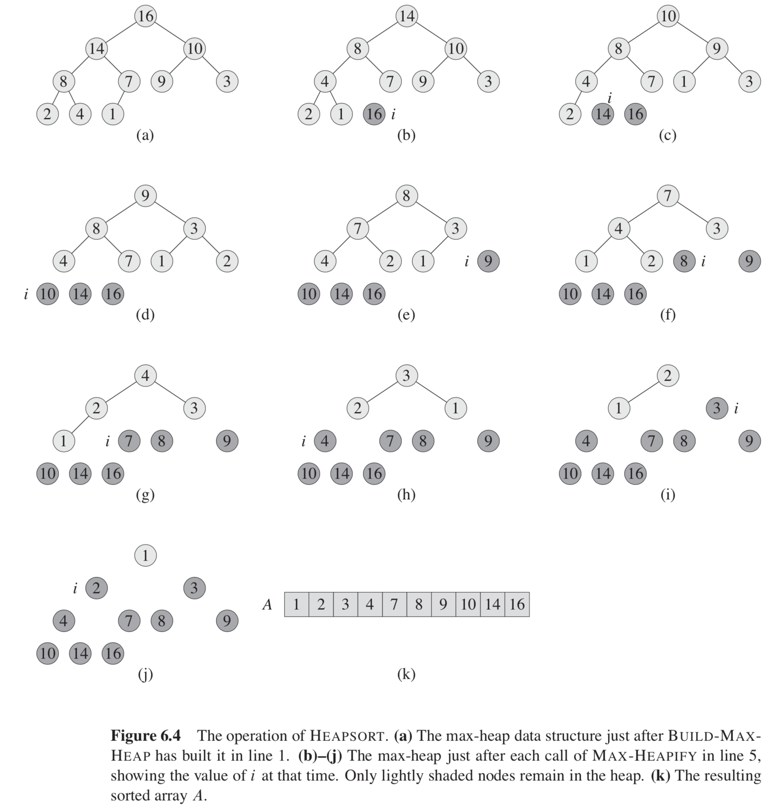

# Binary Heap

## Node relation
```
PARENT(i)
1  return floor(i/2)

LEFT(i)
1  return 2 * i

RIGHT(i)
1  return 2 * i+1
```
## Heapify
Assume the binary trees rooted at LEFT(i) and RIGHT(i) are max-heap, but A[i] might be bigger than its children.<br/>
Let a[i] float down in the heap, so the subtree rooted at i obeys the max-heap property.
```
MAX-HEAPIFY(A, i)  // Running time: O(lg(n))
 1  l = LEFT(i)
 2  r = RIGHT(i)
 3  if l ≤ A.heap_size and A[l] > A[i]
 4      largest = l
 5  else largest = i
 6  if r ≤ A.heap_size and A[r] > A[largest]
 7      largest = r
 8  if largest != i
 9      exchange A[i] with A[largest]
10      MAX-HEAPIFY(A, i)
```
## Extract root
If we want to extract the maximum/minimum number from heap, we can exchange the root with the last index, and discard node n.<br/>
Then, finally, MAX/MIN-HEAPIFY the root and return the maximum/minimum number.
```
HEAP-EXTRACT-MAX(A)  // Running time: O(lg(n))
1  if A.heap_size < 1
2      error "heap underflow"
3  max = A[1]
4  A[1] = A[A.heap_size]
5  A.heap_size = A.heap_size - 1
6  MAX-HEAPIFY(A, 1)
7  return max
```
## Insert
To do insert in heap, we'll first add a minimum/maximum number to the end of the heap, then try to modify the tree to obey Max/Min Heap.<br/>
Therefore, we are going to have HEAP-INCREASE/DECREASE-KEY first.
```
HEAP-INCREASE-KEY(A, i, key)  //
1  if key < A[i]
2      error "new key is smaller than current key"
3  A[i] = key
4  while i > 1 and A[PARENT(i)] < A[i]
5      exchange A[i] with A[PARENT(i)]
6      i = PARENT(i)
```
Next, we can implement INSERT function with HEAP-INCREASE/DECREASE-KEY.
```
INSERT(A, key)
1  MINIMUM = -9999999
2  A.heap_size = A.heap_size + 1
3  A[A.heap_size] = MINIMUM
4  HEAP-INCREASE-KEY(A, A.heap_size, key)
```
## Build a binary heap
* Top-down: Keep insert all the nodes in to the heap.<br/>
```
BUILD-MAX-HEAP(A) // Top down, Running time: O(nlg(n))
1  A.heap_size = A.length
2  for i in A
3      INSERT(i)
```
* Bottom-up: Represent all elements as complete binary tree in beginning, and do MinHeapify from last parent node.<br/>
```
BUILD-MAX-HEAP(A) // Bottom up, Running time: O(nlg(n))
1  A.heap_size = A.length
2  for i = floor(A.length/2) downto 1
3      MAX-HEAPIFY(A, i)
```
## Heap sort algorithm
To do heap sort, first of all, we build heap with HEAP-MAX-HEAP.<br/>
Then, we can exchange the first element with the last element by exchange A[1] with 1[i], in line 3, and we could discard
```
HEAP-SORT(A)  // Running time: O(nlg(n))
1  BUILD-MAX-HEAP(A)
2  for i = A.length downto 2
3      exchange A[1] with A[i]
4      A.heap_size = A.heap_size - 1
5      MAX-HEAPIFY(A, 1)
```
<br/>
## Min Heap C++ example from: https://www.geeksforgeeks.org/binary-heap/
```
// A C++ program to demonstrate common Binary Heap Operations
#include<iostream>
#include<climits>
using namespace std;

// Prototype of a utility function to swap two integers
void swap(int *x, int *y);

// A class for Min Heap
class MinHeap {
    int *harr; // pointer to array of elements in heap
    int capacity; // maximum possible size of min heap
    int heap_size; // Current number of elements in min heap
public:
    // Constructor
    MinHeap(int capacity);

    // to heapify a subtree with the root at given index
    void MinHeapify(int );

    int parent(int i) { return (i-1)/2; }

    // to get index of left child of node at index i
    int left(int i) { return (2*i + 1); }

    // to get index of right child of node at index i
    int right(int i) { return (2*i + 2); }

    // to extract the root which is the minimum element
    int extractMin();

    // Decreases key value of key at index i to new_val
    void decreaseKey(int i, int new_val);

    // Returns the minimum key (key at root) from min heap
    int getMin() { return harr[0]; }

    // Deletes a key stored at index i
    void deleteKey(int i);

    // Inserts a new key 'k'
    void insertKey(int k);
};

// Constructor: Builds a heap from a given array a[] of given size
MinHeap::MinHeap(int cap) {
    heap_size = 0;
    capacity = cap;
    harr = new int[cap];
}

// Inserts a new key 'k'
void MinHeap::insertKey(int k) {
    if (heap_size == capacity) {
        cout << "\nOverflow: Could not insertKey\n";
        return;
    }

    // First insert the new key at the end
    heap_size++;
    int i = heap_size - 1;
    harr[i] = k;

    // Fix the min heap property if it is violated
    while (i != 0 && harr[parent(i)] > harr[i]) {
        swap(&harr[i], &harr[parent(i)]);
        i = parent(i);
    }
}

// Decreases value of key at index 'i' to new_val. It is assumed that
// new_val is smaller than harr[i].
void MinHeap::decreaseKey(int i, int new_val) {
    harr[i] = new_val;
    while (i != 0 && harr[parent(i)] > harr[i]) {
        swap(&harr[i], &harr[parent(i)]);
        i = parent(i);
    }
}

// Method to remove minimum element (or root) from min heap
int MinHeap::extractMin() {
    if (heap_size <= 0)
        return INT_MAX;
    if (heap_size == 1) {
        heap_size--;
        return harr[0];
    }

    // Store the minimum value, and remove it from heap
    int root = harr[0];
    harr[0] = harr[heap_size-1];
    heap_size--;
    MinHeapify(0);

    return root;
}


// This function deletes key at index i. It first reduced value to minus
// infinite, then calls extractMin()
void MinHeap::deleteKey(int i) {
    decreaseKey(i, INT_MIN);
    extractMin();
}

// A recursive method to heapify a subtree with the root at given index
// This method assumes that the subtrees are already heapified
void MinHeap::MinHeapify(int i) {
    int l = left(i);
    int r = right(i);
    int smallest = i;
    if (l < heap_size && harr[l] < harr[i])
        smallest = l;
    if (r < heap_size && harr[r] < harr[smallest])
        smallest = r;
    if (smallest != i) {
        swap(&harr[i], &harr[smallest]);
        MinHeapify(smallest);
    }
}

// A utility function to swap two elements
void swap(int *x, int *y) {
    int temp = *x;
    *x = *y;
    *y = temp;
}

// Driver program to test above functions
int main() {
    MinHeap h(11);
    h.insertKey(3);
    h.insertKey(2);
    h.deleteKey(1);
    h.insertKey(15);
    h.insertKey(5);
    h.insertKey(4);
    h.insertKey(45);
    cout << h.extractMin() << " ";
    cout << h.getMin() << " ";
    h.decreaseKey(2, 1);
    cout << h.getMin();
    return 0;
}

```
